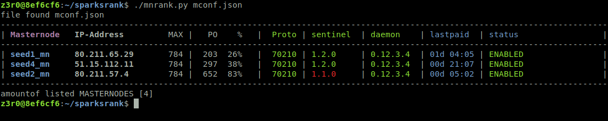
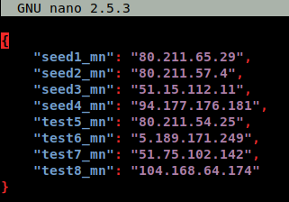
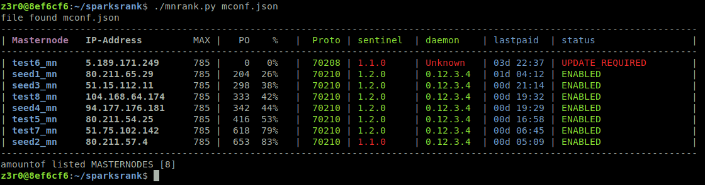

# sparksrank

SparksRank supposes to show you where is your rank in masternode payout system.  
Be shure this is just a position calculation.  

People who wanna use this for their own Coin -> just grab it but leave a link

## grab and start
- First of all you need a running cli-daemon 
- if you don't have your sparks-cli in your $PATH environment [ change ] coin_cli
- be shure your system is synced [ get ] sparks-cli mnsnyc status
- python3 (3.5) is needed

## download
```bash
[ user@mypc:~$ ] git clone https://github.com/m0r4k/sparksrank.git
```
## start
```bash
[ user@mypc:~$ ] cd sparksrank
[ user@mypc:~$ ] python3 mnrank.py
```

If you don't have a configure masternode.conf you can create your own mconf.json [name it as you like to] 
  

```bash
[ user@mypc:~$ ] python3 mnrank.py <name_of_file>
[ user@mypc:~$ ] nano <name_of_file>
```
  

start the script again
```bash
[ user@mypc:~$ ] python3 mnrank.py <name_of_file>
```
  


## FAQ
- Why do I see only empty Line?
    > check your masternode.conf this is filled with the information of your masternode
      so if you do 
  
  > ```bash
  > [ user@mypc:~$ ] sparks-cli masternode list-conf
  > ```

  > and the answer is -> you need to check

  > ```bash
  > [ user@mypc:~$ ] cat ~/.sparkscore/masternode.conf
  > ```

- Is there a MACPORT and/or Windows Version?
  > YES and NO  it is python if you run >python3.5 on your machine you can ran the script.
  You have to mention that your cli (sparks-cli) is in the $PATH Environment of your OS.
  Give mee feedback in issues Section


### Donation
If you want to donate -> you are welcome  
sparks = GX6S6icvknCzXrjpCQdTKwzNuxBCCByVVV
